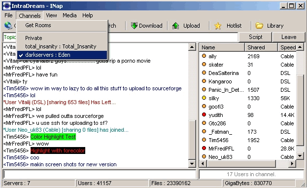



## INap v1\.01 Napster Client

### Description

Fully Functional Napster Client. Added/Fixed a few things since last version. read Fix.txt..

added Teknap/Irc Coloring see colors in related\Colors.txt . after you load the client i recommend sharing at least some files(mp3 only) then after loading. you need to either file/connect or 2 click a server to connect. If you cant get any d/l's to start it has nothing to do with INap but the system itself(not as many people as kazaa / direct connect). but chat system works pretty good.. and supports scripting.. ive writen a few games. look for examples at www.intradream.com later and if youd like an install www.intradream.com/INap.msi
 
### More Info
 

             |
---                |---
**Submitted On**   |2003-08-25 16:52:48
**By**             |[Timothy Marin](https://github.com/Planet-Source-Code/PSCIndex/blob/master/ByAuthor/timothy-marin.md)
**Level**          |Advanced
**User Rating**    |5.0 (20 globes from 4 users)
**Compatibility**  |VB 6\.0
**Category**       |[Complete Applications](https://github.com/Planet-Source-Code/PSCIndex/blob/master/ByCategory/complete-applications__1-27.md)
**World**          |[Visual Basic](https://github.com/Planet-Source-Code/PSCIndex/blob/master/ByWorld/visual-basic.md)
**Archive File**   |[INap\_v1\_011635268252003\.zip](https://github.com/Planet-Source-Code/timothy-marin-inap-v1-01-napster-client__1-47982/archive/master.zip)

